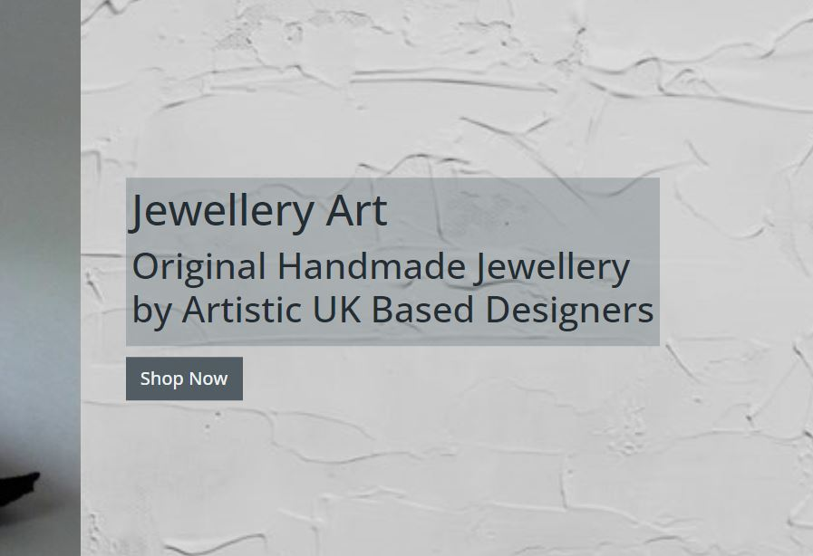
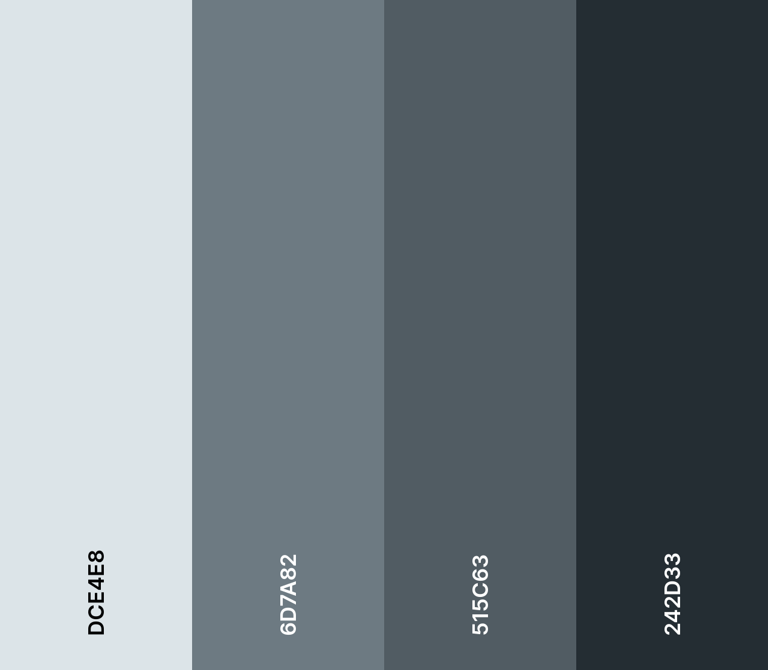
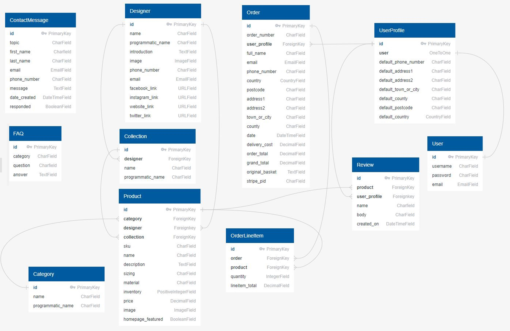
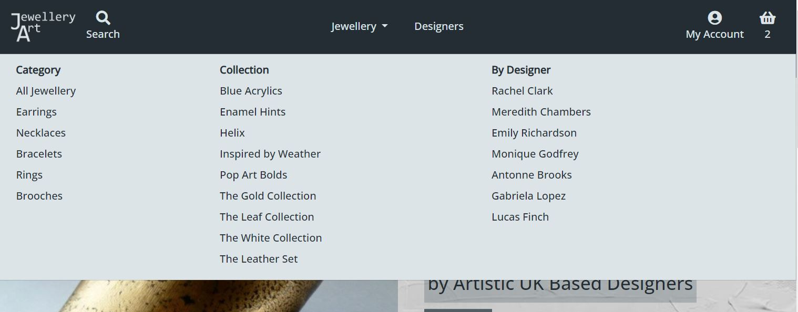
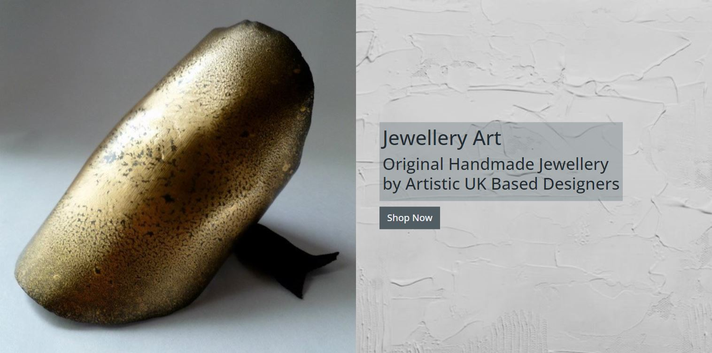
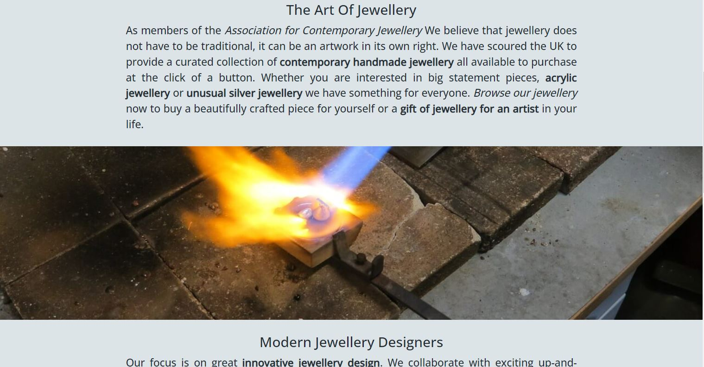
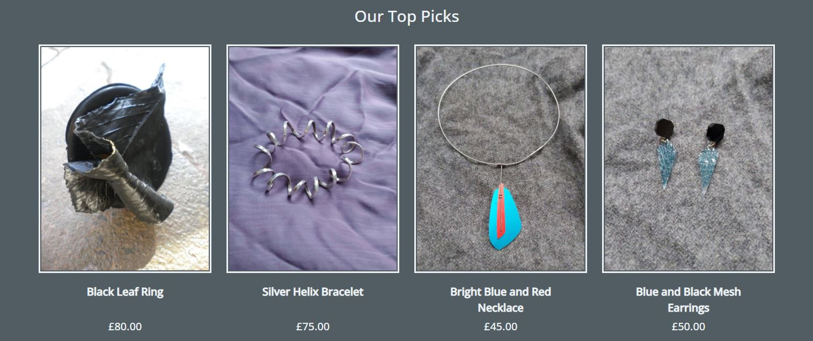

# Jewellery Art

Jewellery Art is an online store that allows users to buy contemporary handmade jewellery. It has a focus towards comtemporary artistic jewellery design and also provides information about and promotes the designers who create the jewellery.

This is an example project not built for real credit card transactions. To test the functionalilty use the test card number 4242 4242 4242 4242 with any expiry date in the future, any 3 number CVC and a 5 number zip code.

[The live site can be found here.](https://jewellery-art.herokuapp.com/)

## Business Strategy

### Site Goals

The general goal of the site is to allow users to find and easily purchase jewellery products. It is focussed towards providing more unusual artistic jewellery and promoting the designers that make the products.

#### Site Owners Goals:
* To easily sell their jewellery products online.
* To promote their most interesting products.
* To highlight their focus on jewellery design by promoting their designers.

#### External Users Goals:
* To browse for interesting contemporary artistic jewellery products.
* To easily purchase jewellery products online.

### Business Model

Jewellery Art is based around a traditional B2C (Business to Customer) model and sells jewellery products to the customer using a single payment system. The products are sourced from various jewellery designers partnered with the site. The focus of the site on jewellery design and designers means that there is also the potential to expand into providing services such as jewellery making classes or perhaps bespoke jewellery design services. These would still likely be single payment purchase rather than subscription services.

### Web Marketing

There is quite a lot of competition in the jewellery market with a high volume of sites focusing on more traditional jewellery, often made of gold or including precious stones. Jewellery Art focuses on the more unusual artistic pieces often found in art gallery shops. There is less competition in this area but it is also more of a niche market with a smaller customer base. Marketing and particularly web marketing would therefore be essential to increase traffic to the site.

Social media marketing is likely to be key in attracting people and building a customer base. An organic approach is likely to be the best starting point when building up interest as the marketing budget would likely be low at the beginning. Potential customers are likely to be artistic themselves or interested in art. This type of person is often active on Instagram and so marketing on this platform would be a must. The image focussed site is likely the suit the business due to the striking products being sold. Most of the designers featured on the site are also likely to be active on social media and so a collaborative social medial marketing approach would be possible increasing the audience. Competitors in this area such as Tatty Devine or Wolf and Moon also target, Facebook and Twitter and these sites should also be utilised. With marketing in mind a Facebook business page has been created and linked to in the site footer. It can be viewed [here](https://www.facebook.com/Jewellery-Art-104568275512777/). If the site is no longer available an image can be found [here](docs/screenshots/facebook-page.jpg).

As sites like this tend to attract artistic people it is not unusual for them to also provide creative jewellery making classes and this would be a great way to attact more customers and make some extra money. These could be promoted on social media and YouTube with videos giving a taster of what is on offer.

Email marketing will also be a useful way to market the site and turn interested parties into paying customers by providing deals and updates on the latest products. A Mailchimp newsletter signup box has been provided at the bottom of the homepage enticing the users with the posibility of offers.

### Search Engine Optimisation

Research has been carried out on keywords associated with sites such as this with the aim of improving SEO. An initial search using Google and Wordtracker of general keywords such as 'Jewellery' or categories such as 'Necklaces' has lead to the conclusion that although these words get a lot of hits, there is also a lot of competition. The sites that they bring up in a search engine are also for the more traditional gold and precious stone jewellery which are not the focus of this site. Further searches found that a more targeted approach combining jewellery with words such as Art and similar reduced the competition and resulted in sites similar to this such as Tatty Devine coming up in the search engines. Specifying the specific materials of the jewellery i.e. 'Acrylic Jewelley' also appears to be a successful approach. From this research a list of keywords including jewelley art, artistic jewellery, jewellery for artists, contemporary handmade jewellery, unusual or unique jewellery, original handmade jewellery, UK jewellery designers have been selected.

The researched keywords have been included in the meta keywords and description in the base.html page and have been used to select the name of the site. The Jewellery Art name has also been included in the site title with important keywords also included in this title on key pages such as the index and products pages.

The homepage has also been designed with SEO in mind. The site title and some of the selected keywords have been included in the most important h1 and h2 headings.

The text sections on the homepage also contain some of the keywords with the important ones within strong tags. Links have been provided to other authoritative sites such as the Association for Contemporary Jewellery and Jewellery Focus. One further thing to note when in comes to SEO is the spelling of jewellery which is different in the USA (jewelry). Research has suggested that the spelling used should not affect the SEO but it is recommended that the spelling most appropriate to the customer base should be selected. In this case, with a UK based company it is jewellery.

All these considerations would hopefully improve the SEO of the site however as acknowledged previously it is catering to a fairly niche market and a marketing strategy as described above will all be key in bringing customers to the site.

## Planning

### User Stories

* #### As a site user:

    **General**
    * I can quickly understand what the site is offering so that I can decide if it meets my needs.
    * I can sign up for a newsletter so I can be kept informed of new products and offers.
    * I can browse frequently asked questions so that I can get answers to my queries.
    * I can fill in a contact form so that I can send a query to the store owner.

    **Viewing Designers**
    * I can view a list of the featured designers so that I can see who makes the jewellery.
    * I can view details of the individual designers so that I can learn more about them and see which products they have designed.

    **Account Registration and Login**
    * I can easily register for an account so that I can have a personal account to store my information.

* #### As a registered user:

    **Account Registration and Login**
    * I can receive a confirmation email after registering so that I can confirm that my account email address is correct.
    * I can easily login or logout or my account so that I can quickly access my account information.

    **User Profiles**
    * I can have a personalised user profile so that I can keep track of my order history.
    * I can save my delivery details to my profile so that I can quickly checkout in future.
    * I can add reviews on the products I have purchased so that I can let the store owner and other customers know what I think of the products.

* #### As a Shopper:

    **Viewing Products**
    * I can quickly view a list of products so that I can browse what is available.
    * I can view details of the individual products so that I can find out more information about them.
    * I can be informed if a product is out of stock so that I do not purchase unavailable products.

    **Product Filtering**
    * I can select products to view based on categories so that I can narrow down on the products I am interested in.
    * I can select products to view based on designers so that I can find products from my favourite designer.
    * I can select products to view based on collections so that I can see which products go together.
    * I can easily see the category selected so that I know what products I am looking at.
    * I can easily see the number of products in a particular filter so that I know how many are available.

    **Product Sorting and Searching**
    * I can sort the products I am viewing so that I can order them in a way most useful to me.
    * I can search the available products based on name or description so that I can quickly find what I am looking for.
    * I can easily see the search made so that I know which products I am looking at.
    * I can easily see the number of products in a particular search so that I know how many are available.

    **Basket**
    * I can easily add a product to the shopping basket so that I can purchase it.
    * I can easily select the quantity of the product I am purchasing so that I can be sure I am buying the right amount.
    * I can see how many products are in my basket whilst browsing so that I can keep track of what I am purchasing.
    * I can view the items in my basket so that I can see what I am purchasing and the total cost.
    * I can adjust or remove items in the basket so that I can easily make changes before checkout.

    **Checkout**
    * I can easily enter my delivery and payment information so that I can checkout quickly with little difficulty.
    * I can be informed if a purchase is successful or unsuccessful so that I can be sure that I will receive my items and do not accidentally make a purchase twice.
    * I can view an order confirmation after checkout so that I can ensure that the purchase is as expected.
    * I can receive a confirmation email of my purchase so that I can keep it for my records.

* #### As a store owner:

    **Admin and Store Management**
    * I can add questions to the frequently asked question section of my site so that I can answer common questions from my customers.
    * I can add a product so that I can add new items to my store.
    * I can edit a product so that I can change the information about it.
    * I can delete a product so that I can remove items that are no longer for sale.
    * I can set or update the inventory of a product so that I can only sell products that are available.
    * I can add a designer so that I can add new designers and their products to my store.
    * I can edit a designer so that I can change the information about them.
    * I can delete a designer so that remove designers that are no longer featured in the store.
    * I can view customer contact forms so that I can respond to them.

### Design

#### Wireframes

The site is designed to attract the users attention and be simple to use thus allowing a customer to quickly find and purchase products of interest. Wireframes for desktop, tablet and mobile views were created to help plan the layout of the site:

* The Wireframes can be viewed using the links below:
    * [Homepage](docs/wireframes/homepage-wireframes.pdf)
    * [Products Page](docs/wireframes/products-page-wireframes.pdf)
    * [Product Detail Page](docs/wireframes/product-detail-page-wireframes.pdf)
    * [Designers Page](docs/wireframes/designers-page-wireframes.pdf)
    * [Designer Detail Page](docs/wireframes/designer-detail-page-wireframes.pdf)
    * [Basket Page](docs/wireframes/basket-page-wireframes.pdf)
    * [Checkout Page](docs/wireframes/checkout-page-wireframes.pdf)
    * [Checkout Success Page](docs/wireframes/checkout-success-page-wireframes.pdf)
    * [Profile Page](docs/wireframes/profile-page-wireframes.pdf)
    * [Contact Page](docs/wireframes/contact-page-wireframes.pdf)

In the course of creating the site some of the layout was tweaked to better fit the different screen sizes. This is particularly true of the footer and checkout success page. The method of selecting the delivery country for price calculation was established during the creation of the site and so an extra country select box was added to the basket page. An FAQ page is also included in the site however a wireframe was not created for this page.

#### Colour Scheme

A monochromatic colour scheme of various shades of grey was chosen for the site in order to not distract from the jewellery products which should be the main source of attention. [Coolor](https://coolors.co/) was used to assist with the colour selection.

### Models and Database Schema

Two relational databases were used to create the site. The built in Django SQLite database was used for development and then Postgres for the deployed version. The site is based around a number of models separated into the following four main groups.

#### User Models

* **User** - the Django Allauth user model containing information such as username and password.
* **UserProfile** - stores a users default delivery information and is connected to the User via a one to one relationship.

#### Designer Models

* **Designer** - stores the details of a jewellery designer including social media links.
* **Collection** - stores details of a collection of a designers jewellery and is connected to the Designer via a foreign key relationship.

#### Product Models

* **Category** - strores the details of a product category.
* **Product** - stores all the details about a product for sale. Connected to the Designer, Collection and Category objects via foreign key relationships.
* **Review** - stores a user review of a product and is connected to the Product and UserProfiles by foreign key relationships.

#### Order Models
* **Order** - stores the full order information and is connected to the UserProfile via a foreign key relationship.
* **OrderLineItem** - stores the product information for a single product purchased on an order. Connected to the Product and Order via foreign key relationships.

Two additional models providing general information for the site user or store owner have also been used.

* **ContactMessage** - stores a site user message submitted through the contact form.
* **FAQ** - stores FAQ questions and answers that the store owner has added to the site.

## Features

### Existing Features

#### Navigation Bar

* The navigation bar is found on all pages and allows the user to easily navigate to the important parts of the site without using the browser navigation buttons.
* It is identical on all pages making it easy for the user to locate.
* The jewellery dropdown menu lists categorised filter options making it easy for the user to navigate to the jewellery they are most interested in.
* The My Account dropdown contains different options depending on user status quickly alerting the user as to whether or not they are logged in. It also contains extra options only visible to the store owner.
* The basket icon indicates how many items it contains making it easy for the user to keep track of what they have added
* The menu collapses to a toggler on smaller screens whilst leaving the account, search and basket links in the navbar allowing for easy navigation across all devices.

#### Footer

* The footer provides links to the social media sites of the store, offering other ways to engage with the store. These links could help attract more customers through shares from existing customers.
* The footer also provides navigation to all the important parts of the site including the Contact Form, FAQ page and privacy policy.

#### Homepage Header

* The top of the home page shows an image of one of the most striking products attracting the users attention and straight away alerting them that the site stocks more unusual artisting jewellery. 
* On larger screens the heading text is displayed on a background of paint brush strokes again evoking the idea of jewellery as an art form.
* A prominent Shop Now button is found below the heading making it easy for the user to quickly browse the products available.

#### Homepage Information sections

* The homepage information sections provide users with an idea of the ethos of the store and its focus on artistic jewellery design and designer collaboration.
* The dividing image of jewellery making also enforces the idea of small scale handmade jewellery production.

#### Homepage Top Picks

* The homepage top picks section is populated by the Products with the homepage_featured field set to true.
* Up to four featured products are displayed with a random selection chosen if more than four homepage_featured products have been selected.
* It allows the store owen to promote their most interesting products and try to entice users to browse further.

