# Jewellery Art

Jewellery Art is an online store that allows users to buy contemporary handmade jewellery. It has a focus towards unusual artistic jewellery design and also provides information about and promotes the designers who create the jewellery.

This is an example project not built for real credit card transactions. To test the functionalilty use the test card number 4242 4242 4242 4242 with any expiry date in the future, any 3 number CVC and a 5 number zip code.

(Not currently deployed)

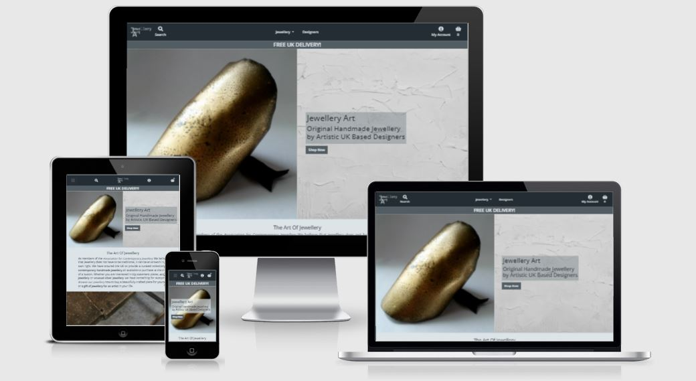

## Table of Contents

- [Business Strategy](#business-strategy)
  * [Site Goals](#site-goals)
    + [Site Owners Goals:](#site-owners-goals)
    + [External Users Goals:](#external-users-goals)
  * [Business Model](#business-model)
  * [Web Marketing](#web-marketing)
  * [Search Engine Optimisation](#search-engine-optimisation)
- [Planning](#planning)
  * [User Stories](#user-stories)
    + [As a site user:](#as-a-site-user)
    + [As a registered user:](#as-a-registered-user)
    + [As a Shopper:](#as-a-shopper)
    + [As a store owner:](#as-a-store-owner)
  * [Design](#design)
    + [Wireframes](#wireframes)
    + [Colour Scheme](#colour-scheme)
  * [Models and Database Schema](#models-and-database-schema)
    + [User Models](#user-models)
    + [Designer Models](#designer-models)
    + [Product Models](#product-models)
    + [Order Models](#order-models)
  * [Agile Workflow](#agile-workflow)
- [Features](#features)
  * [Existing Features](#existing-features)
    + [Navigation Bar](#navigation-bar)
    + [Footer](#footer)
    + [Homepage Header](#homepage-header)
    + [Homepage Information sections](#homepage-information-sections)
    + [Homepage Top Picks](#homepage-top-picks)
    + [Products Page](#products-page)
    + [Product Detail Page](#product-detail-page)
    + [Designers and Designer Detail Pages](#designers-and-designer-detail-pages)
    + [Basket Page](#basket-page)
    + [Checkout Page](#checkout-page)
    + [Checkout Success Page](#checkout-success-page)
    + [Profile Page](#profile-page)
    + [Contact Messages and FAQs](#contact-messages-and-faqs)
    + [The Admin Panel](#the-admin-panel)
  * [Possible Future Features](#possible-future-features)
- [Technologies Used](#technologies-used)
  * [Languages Used](#languages-used)
  * [Frameworks, Libraries & Programs Used](#frameworks-libraries--programs-used)
- [Testing](#testing)
- [Deployment](#deployment)
- [Credits](#credits)
  * [Code](#code)
  * [Media](#media)
  * [Other](#other)

## Business Strategy

### Site Goals

The general goal of the site is to allow users to find and easily purchase jewellery products. It is focussed towards providing more unusual artistic jewellery and promoting the designers that make the products.

#### Site Owners Goals:
* To easily sell their jewellery products online.
* To promote their most interesting products.
* To highlight their focus on jewellery design by promoting their designers.

#### External Users Goals:
* To browse for interesting contemporary artistic jewellery products.
* To easily purchase jewellery products online.

### Business Model

Jewellery Art is based around a traditional B2C (Business to Customer) model and sells jewellery products to the customer using a single payment system. The products are sourced from various jewellery designers partnered with the site. The focus of the site on jewellery design and designers means that there is also the potential to expand into providing services such as jewellery making classes or perhaps bespoke jewellery design services. These would still likely be single payment purchases rather than subscription services.

### Web Marketing

There is quite a lot of competition in the jewellery market with a high volume of sites focusing on more traditional jewellery, often made of gold or including precious stones. Jewellery Art focuses on the more unusual artistic pieces often found in art gallery shops. There is less competition in this area but it is also more of a niche market with a smaller customer base. Marketing and particularly web marketing would therefore be essential to increase traffic to the site.

Social media marketing is likely to be key in attracting people and building a customer base. An organic approach is likely to be the best starting point when building up interest as the marketing budget would likely be low at the beginning. Potential customers are likely to be artistic themselves or interested in art. This type of person is often active on Instagram and so marketing on this platform would be a must. The image focussed site is likely the suit the business due to the striking products being sold. Most of the designers featured on the site are also likely to be active on social media and so a collaborative social medial marketing approach would be possible increasing the audience. Competitors in this area such as Tatty Devine or Wolf and Moon also target, Facebook, Twitter and Pinterest and these sites could also be utilised. With marketing in mind a Facebook business page has been created and linked to in the site footer. It can be viewed [here](https://www.facebook.com/jewelleryartuk/). If the site is no longer available an image can be found [here](docs/screenshots/others/facebook-page.jpg).

As sites like this tend to attract artistic people it is not unusual for them to also provide creative jewellery making classes and this would be a great way to attact more customers and make some extra money. These could be promoted on social media and YouTube with videos giving a taster of what is on offer.

Email marketing will also be a useful way to market the site and turn interested parties into paying customers by providing deals and updates on the latest products. A Mailchimp newsletter signup box has been provided at the bottom of the homepage enticing the users with the posibility of offers.

### Search Engine Optimisation

Research has been carried out on keywords associated with sites such as this with the aim of improving SEO. An initial search using Google and Wordtracker of general keywords such as 'Jewellery' or categories such as 'Necklaces' has lead to the conclusion that although these words get a lot of hits, there is also a lot of competition. The sites that they bring up in a search engine are also for the more traditional gold and precious stone jewellery which are not the focus of this site. Further searches found that a more targeted approach combining jewellery with words such as Art and similar reduced the competition and resulted in sites similar to this such as Tatty Devine coming up in the search engines. Specifying the specific materials of the jewellery i.e. 'Acrylic Jewelley' also appears to be a successful approach. In addition to this Google research suggests that people searching for jewellery also specify a location such as UK and so mentioning the UK based designers could be of benefit. From this research a list of keywords including jewelley art, artistic jewellery, jewellery for artists, contemporary handmade jewellery, unusual or unique jewellery, original handmade jewellery, acrylic jewellery, silver jewellery and UK jewellery designers have been selected.

The researched keywords have been included in the meta keywords and description in the base.html page and have been used to select the name of the site. The Jewellery Art name has been included in the site title with important keywords also included in this title on key pages such as the index and products pages.

The homepage has also been designed with SEO in mind. The site title and some of the selected keywords have been included in the most important h1 and h2 headings.

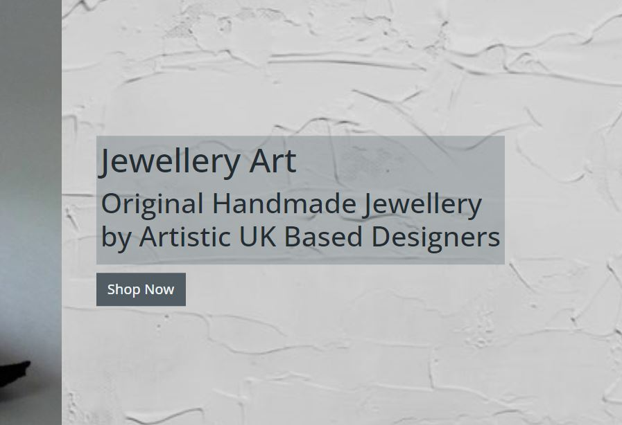

The text sections on the homepage also contain some of the keywords with the important ones within strong tags. Links have been provided to other authoritative sites such as the Association for Contemporary Jewellery and Jewellery Focus. A sitemap.xml and robots.txt file have also been included for SEO purposes.

One further thing to note when it comes to SEO is the spelling of jewellery which is different in the USA (jewelry). Research has suggested that the spelling used should not affect the SEO but it is recommended that the spelling most appropriate to the customer base should be selected. In this case, with a UK based company it is jewellery.

All these considerations would hopefully improve the SEO of the site however as acknowledged previously it is catering to a fairly niche market and a marketing strategy as described above will also be key in bringing customers to the site.

## Planning

### User Stories

* #### As a site user:

    **General**
    * I can quickly understand what the site is offering so that I can decide if it meets my needs.
    * I can sign up for a newsletter so that I can be kept informed of new products and offers.
    * I can browse frequently asked questions so that I can get answers to my queries.
    * I can fill in a contact form so that I can send a query to the store owner.

    **Viewing Designers**
    * I can view a list of the featured designers so that I can see who makes the jewellery.
    * I can view details of the individual designers so that I can learn more about them and see which products they have designed.

    **Account Registration and Login**
    * I can easily register for an account so that I can have a personal account to store my information.

* #### As a registered user:

    **Account Registration and Login**
    * I can receive a confirmation email after registering so that I can confirm that my account email address is correct.
    * I can easily login or logout of my account so that I can quickly access my account information.

    **User Profiles**
    * I can have a personalised user profile so that I can keep track of my order history.
    * I can save my delivery details to my profile so that I can quickly checkout in future.
    * I can add reviews on the products I have purchased so that I can let the store owner and other customers know what I think of the products.

* #### As a shopper:

    **Viewing Products**
    * I can quickly view a list of products so that I can browse what is available.
    * I can view details of the individual products so that I can find out more information about them.
    * I can be informed if a product is out of stock so that I do not purchase unavailable products.

    **Product Filtering**
    * I can select products to view based on categories so that I can narrow down on the products I am interested in.
    * I can select products to view based on designers so that I can find products from my favourite designer.
    * I can select products to view based on collections so that I can see which products go together.
    * I can easily see the category selected so that I know what products I am looking at.
    * I can easily see the number of products in a particular filter so that I know how many are available.

    **Product Sorting and Searching**
    * I can sort the products I am viewing so that I can order them in a way most useful to me.
    * I can search the available products based on name or description so that I can quickly find what I am looking for.
    * I can easily see the search made so that I know which products I am looking at.
    * I can easily see the number of products in a particular search so that I know how many are available.

    **Basket**
    * I can easily add a product to the shopping basket so that I can purchase it.
    * I can easily select the quantity of the product I am purchasing so that I can be sure I am buying the right amount.
    * I can see how many products are in my basket whilst browsing so that I can keep track of what I am purchasing.
    * I can view the items in my basket so that I can see what I am purchasing and the total cost.
    * I can adjust or remove items in the basket so that I can easily make changes before checkout.

    **Checkout**
    * I can easily enter my delivery and payment information so that I can checkout quickly with little difficulty.
    * I can be informed if a purchase is successful or unsuccessful so that I can be sure that I will receive my items and do not accidentally make a purchase twice.
    * I can view an order confirmation after checkout so that I can ensure that the purchase is as expected.
    * I can receive a confirmation email of my purchase so that I can keep it for my records.

* #### As a store owner:

    **Admin and Store Management**
    * I can add questions to the frequently asked question section of my site so that I can answer common questions from my customers.
    * I can add a product so that I can add new items to my store.
    * I can edit a product so that I can change the information about it.
    * I can delete a product so that I can remove items that are no longer for sale.
    * I can set or update the inventory of a product so that I can only sell products that are available.
    * I can add a designer so that I can add new designers and their products to my store.
    * I can edit a designer so that I can change the information about them.
    * I can delete a designer so that I can remove designers that are no longer featured in the store.
    * I can view customer contact forms so that I can respond to them.

### Design

#### Wireframes

The site is designed to attract the users attention and be simple to use thus allowing a customer to quickly find and purchase products of interest. Wireframes for desktop, tablet and mobile views were created to help plan the layout of the site:

* The Wireframes can be viewed using the links below:
    * [Homepage](docs/wireframes/homepage-wireframes.pdf)
    * [Products Page](docs/wireframes/products-page-wireframes.pdf)
    * [Product Detail Page](docs/wireframes/product-detail-page-wireframes.pdf)
    * [Designers Page](docs/wireframes/designers-page-wireframes.pdf)
    * [Designer Detail Page](docs/wireframes/designer-detail-page-wireframes.pdf)
    * [Basket Page](docs/wireframes/basket-page-wireframes.pdf)
    * [Checkout Page](docs/wireframes/checkout-page-wireframes.pdf)
    * [Checkout Success Page](docs/wireframes/checkout-success-page-wireframes.pdf)
    * [Profile Page](docs/wireframes/profile-page-wireframes.pdf)
    * [Contact Page](docs/wireframes/contact-page-wireframes.pdf)

In the course of creating the site some of the layout was tweaked to better fit the different screen sizes. This is particularly true of the footer and checkout success page. The method of selecting the delivery country for delivery price calculation was established during the creation of the site and so an extra country select box was added to the basket page. An FAQ page is also included in the site however a wireframe was not created for this page.

#### Colour Scheme

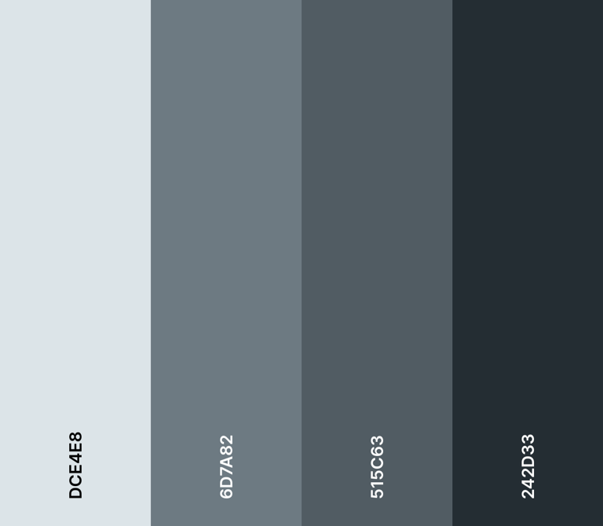

A monochromatic colour scheme of various shades of grey was chosen for the site in order to not distract from the jewellery products which should be the main source of attention. [Coolor](https://coolors.co/) was used to assist with the colour selection.

### Models and Database Schema

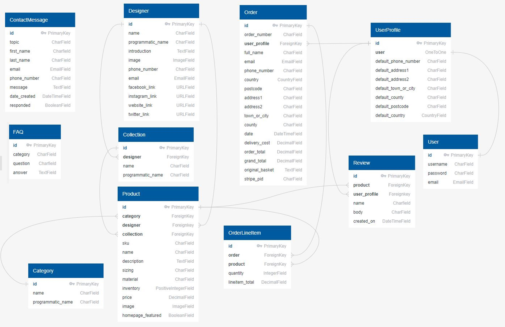

Two relational databases were used to create the site. The built in Django SQLite database was used for development and then Postgres for the deployed version. The site is based around a number of models separated into the following four main groups.

#### User Models

* **User** - the Django Allauth user model containing information such as username and password.
* **UserProfile** - stores a users default delivery information and is connected to the User via a one to one relationship.

#### Designer Models

* **Designer** - stores the details of a jewellery designer including social media links.
* **Collection** - stores details of a collection of a designers jewellery and is connected to the Designer via a foreign key relationship.

#### Product Models

* **Category** - strores the details of a product category.
* **Product** - stores all the details about a product for sale. Connected to the Designer, Collection and Category objects via foreign key relationships.
* **Review** - stores a user review of a product and is connected to the Product and UserProfile by foreign key relationships.

#### Order Models
* **Order** - stores the full order information and is connected to the UserProfile via a foreign key relationship.
* **OrderLineItem** - stores the product information for a single product purchased on an order. Connected to the Product and Order via foreign key relationships.

Two additional models providing general information for the site user or store owner have also been used.

* **ContactMessage** - stores a site user message submitted through the contact form.
* **FAQ** - stores FAQ questions and answers that the store owner has added to the site.

### Agile Workflow

A basic agile strategy has been used when planning and implementing the functionality of this project. The project user stories have been added to Github as issues and selected user stories moved to milestones for two week iterations which have been tracked on a projet Kanban board. The user stories for each iteration have been separated into Must Have, Should Have and Could Have categories.

Although this approach was useful when it came to ensuring all functionality was implemented, for this project the time required to complete the user stories was somewhat overestimated. The Must Have stories were often completed in the first week with all Should Have and Could Have stories completed by the end of the iteration. More time spent accurately estimating story points for each user story would be beneficial in the future.

Additional user stories for possible future functionality, specifically the providing of jewellery making classes, have also been added to the project as Github issues.

## Features

### Existing Features

#### Navigation Bar

* The navigation bar is found on all pages and allows the user to easily navigate to the important parts of the site without using the browser navigation buttons.
* It is identical on all pages making it easy for the user to locate.
* The jewellery dropdown menu lists categorised filter options making it easy for the user to navigate to the jewellery they are most interested in.
* The My Account dropdown contains different options depending on user status quickly alerting the user as to whether or not they are logged in. It also contains extra options only visible to the store owner.
* Only anonymous users can access the sign up or login pages and only logged in users can acces the profile or logout pages.
* The basket icon indicates how many items it contains making it easy for the user to keep track of what they have added.
* The menu collapses to a toggler on smaller screens whilst leaving the account, search and basket links in the navbar allowing for easy navigation across all devices.

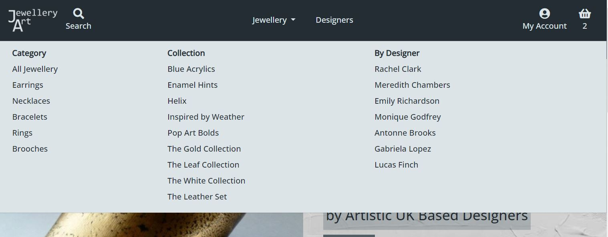

#### Footer

* The footer provides links to the social media sites of the store, offering other ways to engage with the store. These links could help attract more customers through shares from existing customers.
* The footer also provides navigation to all the important parts of the site including the Contact Form, FAQ page and privacy policy.

#### Homepage Header

* The top of the home page shows an image of one of the most striking products attracting the users attention and straight away alerting them to the fact that the site stocks more unusual artistic jewellery. 
* On larger screens the heading text is displayed on a background of paint brush strokes again evoking the idea of jewellery as an art form.
* A prominent Shop Now button is found below the heading making it easy for the user to quickly browse the products available.

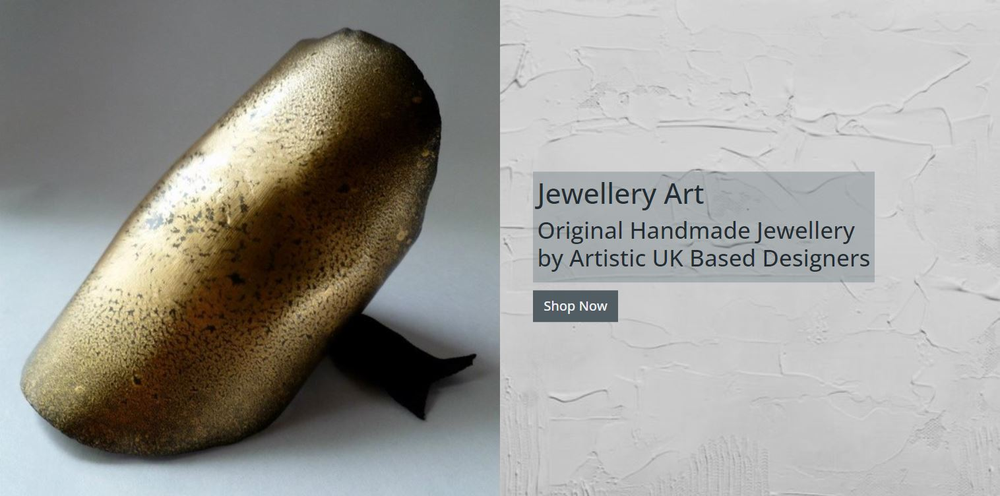

#### Homepage Information sections

* The homepage information sections provide users with an idea of the ethos of the store and its focus on artistic jewellery design and designer collaboration.
* The dividing image of jewellery making also enforces the idea of small scale handmade jewellery production.

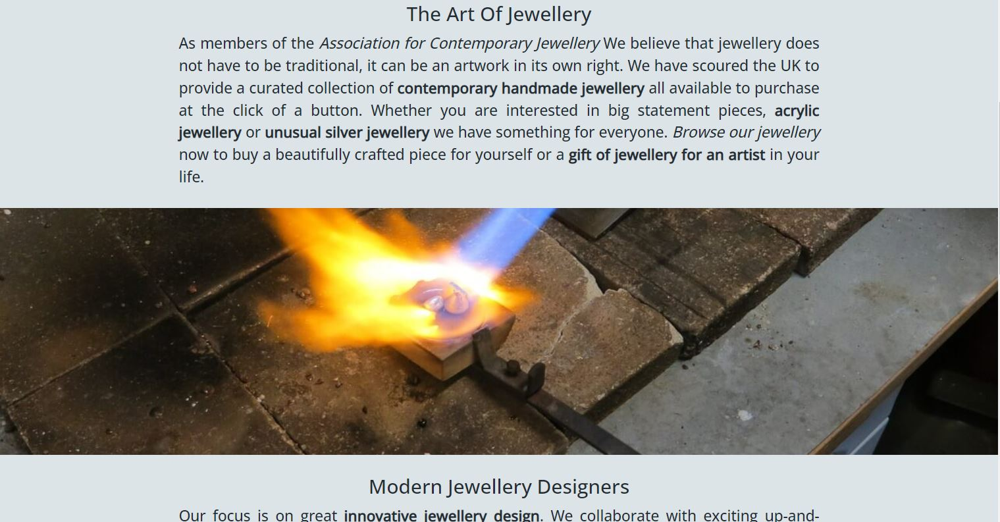

#### Homepage Top Picks

* The homepage top picks section is populated by the Products with the homepage_featured field set to true.
* Up to four featured products are displayed with a random selection chosen if more than four homepage_featured products have been selected.
* It allows the store owner to promote their most interesting products and try to entice users to browse further.

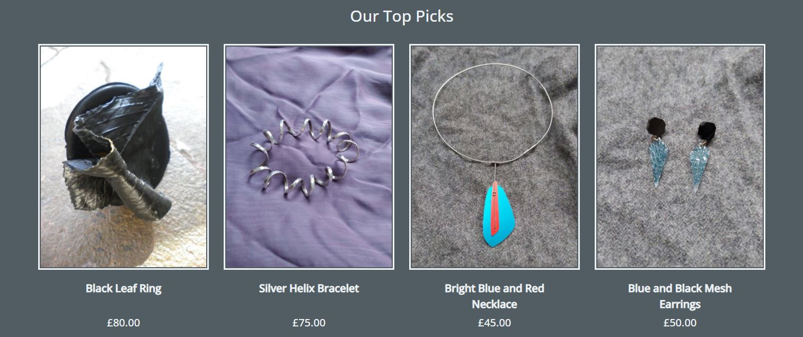

#### Products Page

* The products page displays a list of product cards for the user, the products displayed depends upon the filters or search the user may have selected.
* The black border around the images gives the impression of framed art works tying in with the store ethos of jewellery as art.
* Out of stock labels are displayed on out of stock products ensuring that users do not try to purchase unavailable products.
* The page heading indicates the filter or search that has been applied and how many products are displayed making it easy for the user to know what they are looking at.
* The sort box makes it easy for the user to sort the products to their liking.
* Links are provided at the top to the all products or different category pages making navigation for the user even easier.
* Additional Edit, Delete, Homepage Featured Select and Inventory Update options are displayed on this page when the superuser is logged in.

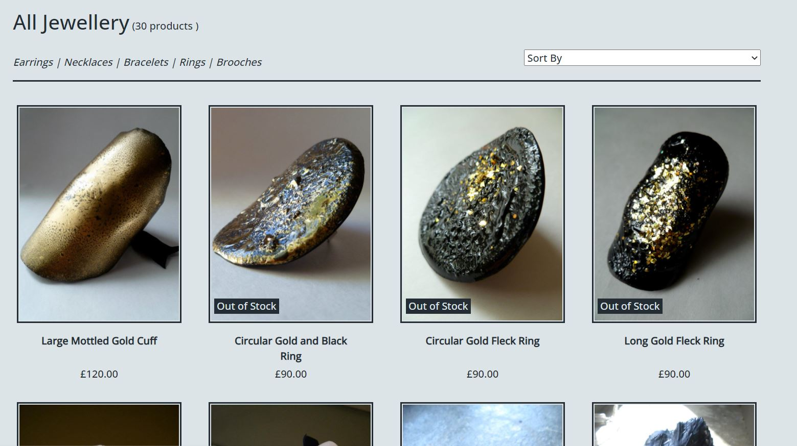

#### Product Detail Page

* The product detail page provides additional information about the products.
* Out of stock labels are displayed on the product if out of stock and the add to basket functionality is disabled ensuring that users do not try to purchase unavailable products.
* The details accordion allows the user to pick and chose the information they want to display and keeps the page from getting too long.
* The also by designer section entices the user by suggesting other products by the same designer.
* A review form is displayed in the review section for registered users who have purchased the product making it easy for the user to leave a review.

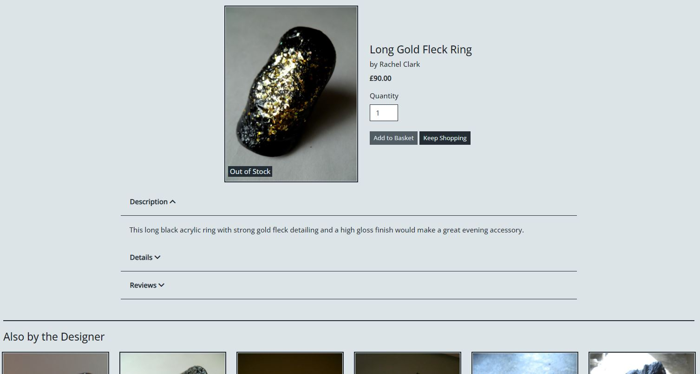

#### Designers and Designer Detail Pages

* The designers and designer detail pages allow the store owner to promote the designers who create the jewellery products.
* These pages backup the idea that the store supports unique independent design.
* The designer detail page showcases products by that specific designer encouraging the user to purchase more pieces by their favourite designer.

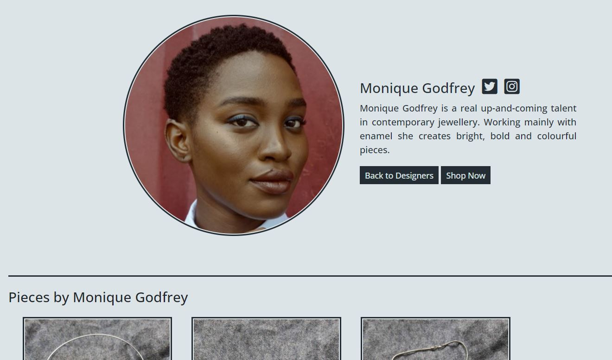

#### Basket Page

* The basket page provides a summary of the items in the basket and the total prices.
* The user has the ability to update or remove items in the basket making it easy for them to make their final purchasing decisions.
* The country box allows the user to select their delivery country and so calculate the delivery cost. This allows the store owner to offer free delivery to the UK.

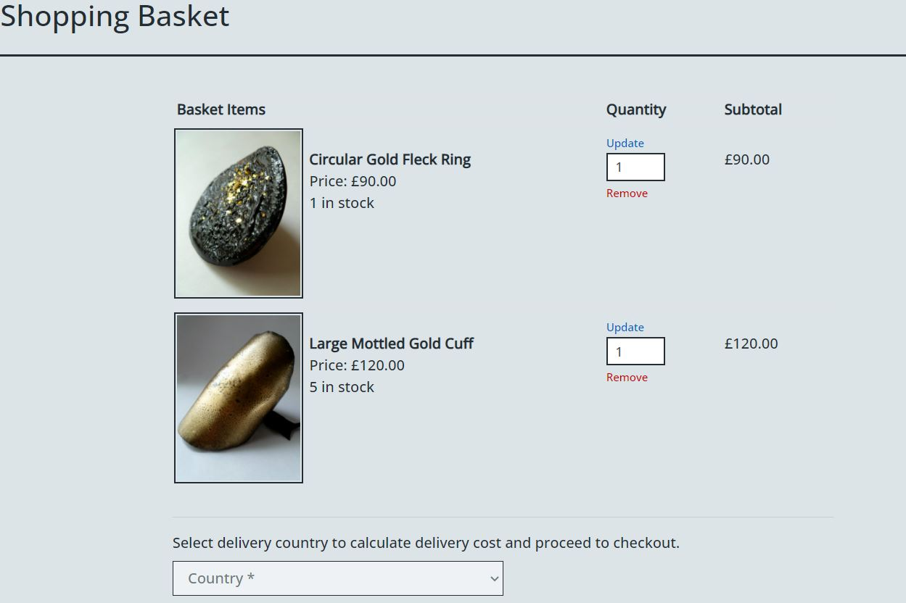

#### Checkout Page

* It is possible to purchase from the store as a guest or registered user.
* Before an anonymous user is taken to the checkout page, they are taken to the login or guest page. This gives them the option of guest checkout and also provides reasons for why they may wish to register for an account.
* The checkout page consists of a simple form making it quick and easy for the user to checkout.
* The page shows a summary of the basket items and totals ensuring that the user knows exactly what they are purchasing.
* An inventory check is carried out before any payment is processed ensuring that the customer does not purchase out of stock items.

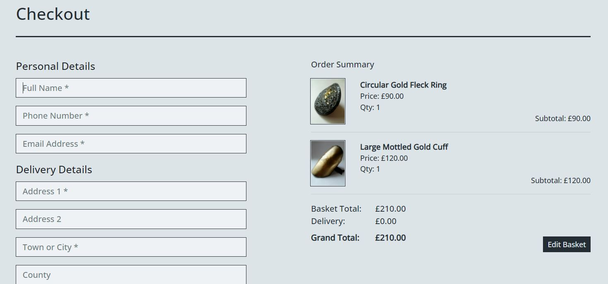

#### Checkout Success Page

* A checkout success page is loaded when the order has been processed ensuring that the user is informed if their purchase was successful.
* An email of the order confirmation is also sent to the user.
* The emailed order confirmation is sent even if the user closes the page before the checkout success page can load to ensure that the user is aware that they have made a purchase.

#### Profile Page

* The profile page provides an easy way for a registered user to keep track of their order history and update their default delivery details.
* Product reviews that the user has created are also listed and it is easy for them to edit or delete these or add further reviews.

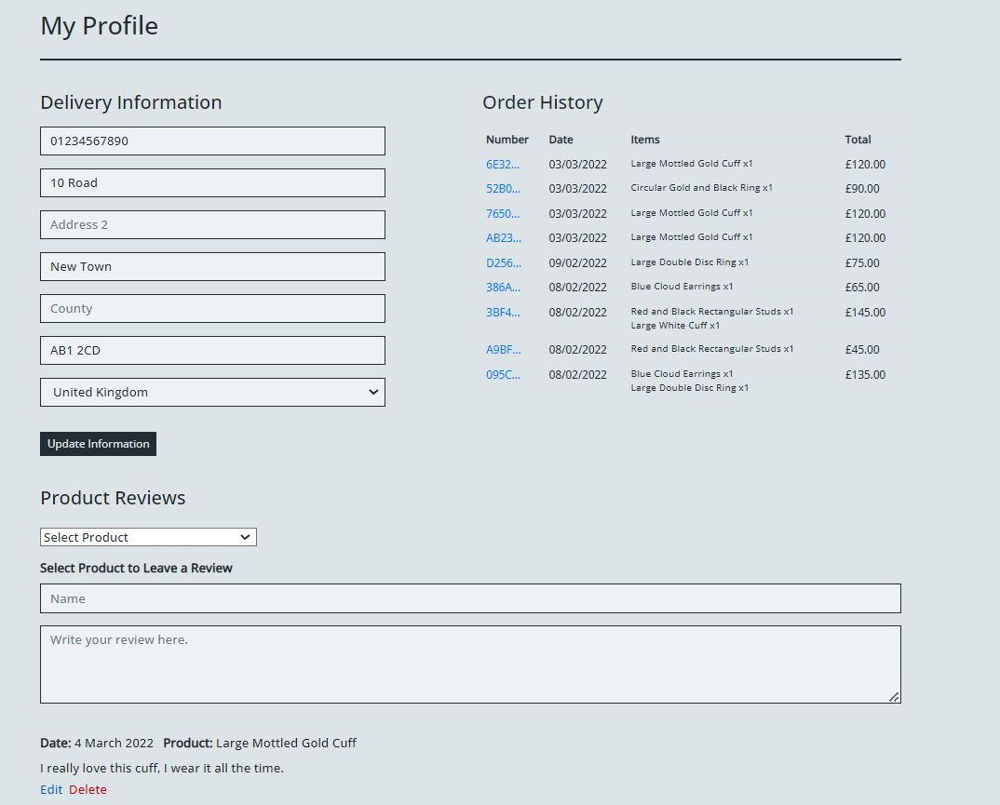

#### Contact Messages and FAQs

* The contact form and FAQs page provide the store owner with additional ways to provide information to their customers.
* The store user can easily add an FAQ via the add FAQ page and these will straight away be displayed for the customers on the site.
* The contact form provides a way for a site user to communicate directly with the store owner.
* The manage contact messages page makes it easy for the store owner to keep track of the messages from their customers with the response required flag quickly alerting them to those which have not yet been dealt with.

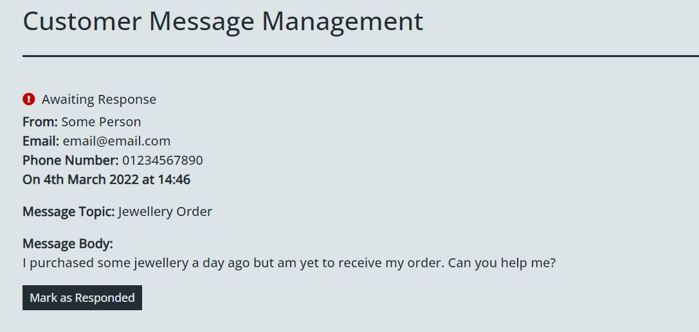

#### The Admin Panel

* The admin panel gives the store owner further control over the site and allows them access to model objects not available elsewhere, particularly the orders.

### Possible Future Features

* The ability for the site owner to add new jewellery collections on the designer pages or when adding or editing a designer.
* A way for the store owner to quickly update the inventory of multiple products at a time.
* Store owner approval on product reviews.
* The ability for the site owner to link products such as matching earrings and necklaces etc. to populate a 'Pairs With' section on the product detail page.
* Dedicated order tracking page with the orders possibly linked to additional shipping models so that the site user can keep track of when orders have been made, processed and shipped.
* Jewellery making workshop pages where customers can book places on jewellery making classes run by the designers and add them to their basket for payment.

## Technologies Used

### Languages Used
* [HTML5](https://en.wikipedia.org/wiki/HTML5), [CSS3](https://en.wikipedia.org/wiki/CSS), [JavaScript](https://en.wikipedia.org/wiki/JavaScript), [Python](https://en.wikipedia.org/wiki/Python_(programming_language))

### Frameworks, Libraries & Programs Used

* [Django](https://www.djangoproject.com/) is the MVC framework used to create the site.
* [Django Allauth](https://django-allauth.readthedocs.io/en/latest/index.html) has been used to set up user authentication on the site.
* [Django Crispy Forms](https://django-crispy-forms.readthedocs.io/en/latest/) has been used to add bootstrap styling to the forms used.
* [Django Countries](https://pypi.org/project/django-countries/) has been used for the delivery country CountryField.
* [Bootstrap 4.6](https://getbootstrap.com/docs/4.6/getting-started/introduction/) has been used to assist with the styling of the site and particularly the responsiveness.
* [Hover.css](https://ianlunn.github.io/Hover/) has been used to apply colour change to links and buttons when hovered over.
* [jQuery](https://jquery.com/) has been used for some of the Bootstrap components and also in some of the custom JS used throughout the site.
* [Google Fonts](https://fonts.google.com/) has been used for the Open Sans font used throughout the site.
* [Font Awesome](https://fontawesome.com/) has been used for all the icons on the site.
* [TinyPNG](https://tinypng.com/) and [Compressor](https://compressor.io/) have been used to compress the images used on the site with Microsoft PowerPoint used to cut them to size.
* [Mailchimp](https://mailchimp.com/) has been used to create the newsletter signup form.
* [Facebook Pages](https://www.facebook.com/pages/) has been used to create the Facebook Business Page linked to from the site.
* [Stripe](https://stripe.com/gb) has been used for the processing of payments.
* [Heroku](https://www.heroku.com) has been used to deploy the site.
* [Gunicorn](https://gunicorn.org/) has been used as the server to run Django on Heroku.
* [Amazon AWS](https://aws.amazon.com/) has been used to store the static and media files for the site.
* [PostgresSQL](https://www.postgresql.org/) has been used as the database for the site.
* [Git](https://git-scm.com/) has been used for version control by using the Gitpod terminal to commit and push code to GitHub.
* [Github](https://github.com/) has been used to store the project's code.

## Testing

The project has been thoroughly tested through both manual and automated testing. Details of the testing can be found [here](TESTING.md).

## Deployment

The project has been deployed to Heroku. Detail of the steps taken to deploy the site can be found [here](DEPLOYMENT.md).

## Credits

### Code

* A lot of the initial functionalilty for the site was taken from the Code Institute **Boutique Ado** walkthrough project and adapted and added to as required.
* The code institute **Hello Django** and **I Think Therefore I Blog** walkthroughs were also consulted.
* The following stack overflow threads were used for assistance:
    * Assistance with creating a full width Navbar dropdown menu was found [here](https://stackoverflow.com/questions/49659305/).
    * Information in centering an absolutely positioned div inside another div was found [here](https://stackoverflow.com/questions/34741593/).
    * Assistance with Django custom template tags was found [here](https://stackoverflow.com/questions/7954011/).
    * Assistance with establishing the original size of a displayed image was found [here](https://stackoverflow.com/questions/1944280/).
    * Information on how to set the HTTP_REFERER value in Django testing was found [here](https://stackoverflow.com/questions/11801946/).
    * Information on an alternative way to get messages in testing was found [here](https://stackoverflow.com/questions/16143149/).
    * Information on how to get the request object in Django testing was found [here](https://stackoverflow.com/questions/10277748/).
    * Information on how to solve a transaction management error whilst testing was found [here](https://stackoverflow.com/questions/21458387/)
* Further assistance and information was taken from the following:
    * Information on how to remove duplicates from a Python list was found [here](https://www.w3schools.com/python/python_howto_remove_duplicates.asp).
    * Assistance with setting the aspect ratio for displayed images was found [here](https://css-irl.info/aspect-ratio-is-great/).
    * This [guide](https://realpython.com/django-redirects/) was used for assistance with Django redirects.
    * This Code Institute [Slack post](https://code-institute-room.slack.com/archives/C7HS3U3AP/p1605222094452700) was used to fix a bug with the checkout Save Info checkbox.

### Media

* The image of designer Lucas Finch was taken by Christian Buehner and found on [Unsplash](https://unsplash.com/photos/DItYlc26zVI).
* The image of designer Emily Richardson was taken by Rachel McDermott and found on [Unsplash](https://unsplash.com/photos/0fN7Fxv1eWA).
* The image of designer Meredith Chambers was taken by RF._.studio and found on [Pexels](https://www.pexels.com/photo/pensive-elderly-woman-in-eyeglasses-and-trendy-bomber-3867213/).
* The image of designer Monique Godfrey was taken by Prince Akachi and found on [Unsplash](https://unsplash.com/photos/J1OScm_uHUQ).
* The image of designer Antonne Brooks was taken by Ant Miner and found on [Unsplash](https://unsplash.com/photos/VK48kub0ibk).
* The image of designer Gabriela Lopez was taken by Raamin Ka and found on [Unsplash](https://unsplash.com/photos/0qJBEzudn5E).
* The brush strokes homepage background image was taken by Steve Johnson and found on [Unsplash](https://unsplash.com/).
* The homepage jewellery making image was taken by firemystery and found on [Pixabay](https://pixabay.com/).
* The image of Rachel Clark and all of the images of her jewellery were used with the permission of Rachel. In a ideal world she would have photographed all the jewellery for a much more stylish feel!
* All other jewellery images were taken by myself using my mother's jewellery from various sources including the [Tate](https://shop.tate.org.uk/jewellery) and [Love Dazzle](https://www.lovedazzle.com/).

### Other

* The Code Institute [template](https://github.com/Code-Institute-Org/gitpod-full-template) was used to make the project repository on GitHub.
* The wireframes for the project were created using [Balsamiq](https://balsamiq.com/wireframes/desktop/).
* The database schema was created using [Quick Database Diagrams](https://www.quickdatabasediagrams.com/).
* The mockup of the website in the README.md was created using [Am I Responsive?](http://ami.responsivedesign.is/).
* The README.md table of contents was created using [Markdown TOC](https://ecotrust-canada.github.io/markdown-toc/).
