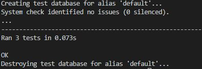
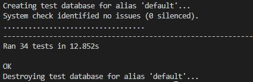
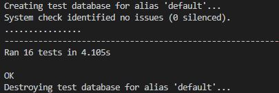
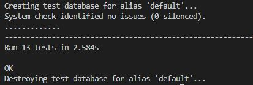
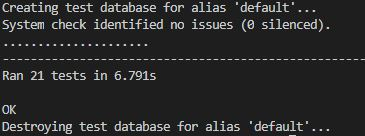
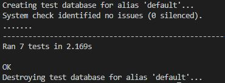
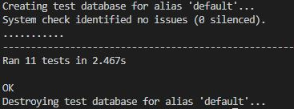
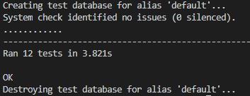

## Testing

### Table of Contents

- [User Story Testing](#user-story-testing)
  * [As a Site user:](#as-a-site-user)
  * [As a registered user:](#as-a-registered-user)
  * [As a shopper:](#as-a-shopper)
  * [As a store owner:](#as-a-store-owner)
  * [General Goals](#general-goals)
- [Validator Testing](#validator-testing)
  * [HTML](#html)
  * [CSS](#css)
  * [JS](#js)
  * [Python](#python)
- [Python Automated Testing](#python-automated-testing)
- [Manual Testing](#manual-testing)
- [Fixed Bugs](#fixed-bugs)

### User Story Testing

#### As a Site user:

**General**
* I can quickly understand what the site is offering so that I can decide if it meets my needs.
    * The homepage headings pared with the Shop Now button succinctly describe the purpose of the site.
    * The striking image gives a stylish representation of the types of products on offer.
* I can sign up for a newsletter so I can be kept informed of new products and offers.
    * A newsletter signup form is provided on the homepage.
* I can browse frequently asked questions so that I can get answers to my queries.
    * A link to the FAQ page can be found on every page of the site in the footer.
* I can fill in a contact form so that I can send a query to the store owner.
    * A link to the contact form can be found on every page of the site in the footer.

**Viewing Designers**
* I can view a list of the featured designers so that I can see who makes the jewellery.
    * The Designers page provides a list of the jewellery designers with links to their detail pages.
* I can view details of the individual designers so that I can learn more about them and see which products they have designed.
    * The Designer Detail page provides information about each of the designers including their social media links.
    * The Pieces By section also gives the user the opportunity to browse through the products they have designed.

**Account Registration and Login**
* I can easily register for an account so that I can have a personal account to store my information.
    * The navigation bar provides easily locatable My Account menus with a link for registration.
    * The registration form is clear and simple to use making registration quick and easy.

#### As a registered user:

**Account Registration and Login**
* I can receive a confirmation email after registering so that I can confirm that my account email address is correct.
    * Upon registration an email is sent to the registered email address asking the user to confirm their email address.
* I can easily login or logout of my account so that I can quickly access my account information.
    * The My Account menu clearly shows the user whether or not they are logged in and provides simple to use login or logout links.

**User Profiles**
* I can have a personalised user profile so that I can keep track of my order history.
    * A user profile is created when the user registers. A link to the users profile is found in the My Account menu, it provides a list of all the orders the user has made.
* I can save my delivery details to my profile so that I can quickly checkout in future.
    * A delivery details form is provided on the Profile page allowing the user to update their delivery details.
    * The user can also update their delivery details directly from the checkout.
    * The saved delivery details are used to populate the checkout form.
* I can add reviews on the products I have purchased so that I can let the store owner and other customers know what I think of the products.
    * An add review for is available to logged in customers who have purchased a specific product on the Product Detail page.
    * They can also add reviews on their Profile page as well as edit and delete reviews they have already made.

#### As a shopper:

**Viewing Products**
* I can quickly view a list of products so that I can browse what is available.
    * The Products page easily accessible from the navigation bar or homepage shop now button quickly provides the user with a list of the products available and their prices.
* I can view details of the individual products so that I can find out more information about them.
    * The Products page provides links to the individual Product Detail pages which provide clear information about the product and show others by the designer.
* I can be informed if a product is out of stock so that I do not purchase unavailable products.
    * The Out of Stock badge on the products provides a clear indication that the product is out of stock. The disabled add to basket functionality means that the user cannot add out of stock items to the basket.

**Product Filtering**
* I can select products to view based on categories so that I can narrow down on the products I am interested in.
    * The navigation bar provides easy to select categories allowing the shopper to filter the products to a smaller selection.
* I can select products to view based on designers so that I can find products from my favourite designer.
    * The navigation bar provides easy to select designers allowing the shopper to filter the products by a specific designer.
* I can select products to view based on collections so that I can see which products go together.
    * The navigation bar provides easy to select collections allowing the shopper to filter the products to only those from a specific collection.
* I can easily see the category selected so that I know what products I am looking at.
    * The Products page title updated based on the filtering clearly tells the shopper which products they are looking at.
* I can easily see the number of products in a particular filter so that I know how many are available.
    * The number of products in the filter is clearly displayed next to the page title.

**Product Sorting and Searching**
* I can sort the products I am viewing so that I can order them in a way most useful to me.
    * The sort box at the top of the products page provides an easy way for the shopper to sort the products based on different criteria. This box is updated based on the filter applied.
* I can search the available products based on name or description so that I can quickly find what I am looking for.
    * The search box in the navigation bar provides an easy way for the shopper to search for products based on keywords.
* I can easily see the search made so that I know which products I am looking at.
    * The heading on the Products page updates to tell the shopper which search they have made.
* I can easily see the number of products in a particular search so that I know how many are available.
    * The number of products in the search is clearly displayed next to the page title.

**Basket**
* I can easily add a product to the shopping basket so that I can purchase it.
    * The Product Detail page provides a prominent Add to Basket button allowing the customer to easily add the item to the basket. The success message makes it clear the item has been added.
* I can easily select the quantity of the product I am purchasing so that I can be sure I am buying the right amount.
    * The quantity box on the Product Detail page provides an easy way to select the quantity to add to the basket. A stock warning is displayed when the quantity exceeds the inventory.
* I can see how many products are in my basket whilst browsing so that I can keep track of what I am purchasing.
    * The basket icon easily found in the navigation bar shows the customer the number of items that they have added to the basket.
* I can view the items in my basket so that I can see what I am purchasing and the total cost.
    * The basket icon in the navigation bar takes the shopper to the basket where a clear list of the items it contains is shown.
* I can adjust or remove items in the basket so that I can easily make changes before checkout.
    * The basket page has update or delete options for every item in the basket.

**Checkout**
* I can easily enter my delivery and payment information so that I can checkout quickly with little difficulty.
    * The checkout page has a simple to use form for filling in the required details.
* I can be informed if a purchase is successful or unsuccessful so that I can be sure that I will receive my items and do not accidentally make a purchase twice.
    * Messages are displayed telling the shopper whether the purchase has been successful or unsuccessful. The checkout success page is displayed after a successful purchase.
* I can view an order confirmation after checkout so that I can ensure that the purchase is as expected.
    * The checkout success page summarises all the details of the order.
* I can receive a confirmation email of my purchase so that I can keep it for my records.
    * An order summary is emailed to the customer on successful purchase.

#### As a store owner:

**Admin and Store Management**
* I can add questions to the frequently asked question section of my site so that I can answer common questions from my customers.
    * The Add FAQ page is easily accessed in the My Account menu in the navigation bar. Once an FAQ is added on this page it will straight away populate the FAQs page.
* I can add a product so that I can add new items to my store.
    * The Add a Product page is easily accessible from the My Account menu in the navigation bar making it easy to add a product to the store.
* I can edit a product so that I can change the information about it.
    * All the products on the Products and Product Detail page have edit links when the Superuser is signed in so that they can be easily edited.
* I can delete a product so that I can remove items that are no longer for sale.
    * All the products on the Products and Product Detail page have delete links when the Superuser is signed in so that they can be easily deleted.
* I can set or update the inventory of a product so that I can only sell products that are available.
    * All the products on the Products page show an update inventory form to the Superuser so that they can update the inventory of the product.
* I can add a designer so that I can add new designers and their products to my store.
    * The Add a Designer page is easily accessible from the My Account menu in the navigation bar making it easy to add a designer to the store.
* I can edit a designer so that I can change the information about them.
    * All the designers on the Designers and Designer Detail page have edit links when the Superuser is signed in so that they can be easily edited.
* I can delete a designer so that remove designers that are no longer featured in the store.
    * All the designers on the Designer and Designer Detail page have delete links when the Superuser is signed in so that they can be easily deleted.
* I can view customer contact forms so that I can respond to them.
    * The Customer Message Management page accessible from the My Account menu on the navigation bar provides an easy way for the store owner to keep track of customer messages.

#### General Goals

The site provides value to the user as a place that they can find different and unusual jewellery. It is easy to use making it easy for them to purchase the products on offer. The site owner has a place to add and sell their products online. The designer section allows them to promote their interest in good design and promote the designers which would likely result in some reciprical marketing as the designers promote the site on social media. The homepage featured option allows the store owner to keep the site fresh by updating the list of top products on the homepage.

### Validator Testing

#### HTML

* All pages have been passed through the [W3C validator](https://validator.w3.org/) using URI input and direct input for the authorised user areas.
* The check showed that list elements should not be used for the icon links in the navigation bar and these have been changed to div elements.
* The checks also highlighted problems with duplicate ids on the update inventory form on the Products page and edit review form on the profiles page. These have been fixed by adding the model object primary key value to the ids.
* No errors are now returned for all pages.

#### CSS

* All CSS files have been passed through the [Jigsaw validator](https://jigsaw.w3.org/css-validator/) using direct input.
* No errors have been found.

#### JS

* The Javascript snippets have been passed through the [JSHint](https://jshint.com/) validator.
* Missing semicolons were flagged and have been added to the files.
* The following warning was given on the designers.js file image check. This has been solved by moving the image check function out of the for loop.  
    * Functions declared within loops referencing an outer scoped variable may lead to confusing semantics.
* No other errors have been found.

#### Python

* All non Django populated Python files have been passed through the [PEP8 online](http://pep8online.com/) check with no errors flagged.
* The Gitpod built in linter has also been used throughout development to improve the Python code through the shortening of lines and addition of docstrings.

### Python Automated Testing

Automated testing on original Python code from all apps has been carried out using the Django testing framework. The following tests have been carried out:

**Home App - Views**
* The get index page and get privacy policy page views return a successful HTTP response and use the correct template.
* The homepage featured products context always contains products up to a maximum of 4 products.

**Home App - Results**
* All tests passed.

**Products App - Models**
* The Category, Product and Review models string methods return the expected strings.
* The Category model programmatic_name field is generated and is as expected.
* The Product homepage_featured field defaults to false.

**Products App  - Forms**
* The model required fields are required on the Product and Review form.
* Unrequired fields are not required on the Product form.

**Products App - Product Views**
* The various get views return a successful HTTP response and use the correct templates.
* The all_products view category, designer and collection filters and search option return the correct products.
* The all_products view sort option orders the products correctly.
* The product_detail view other products context contains the correct products and the purchased context contains the correct value.
* The add_product, edit_product and delete_product views successfully add, edit and delete products and redirect to the correct page.
* The toggle_homepage_featured view correctly changes the value of the homepage_featured field and redirects as expected.
* The update_inventory view updates a product inventory and redirects as expected.
* The superuser only areas correctly redirect other users.
* Error messages are generated when the product form is not valid and when a get request is sent to the update_inventory view.

**Products App - Review Views**
* The add_review, edit_review and delete_review views successfully add, edit and delete reviews and redirect to the correct page.
* Error messages are generated when the review form is not valid, when the user reviews a product they have not purchased or edits another user's review.
* Error messages are generated when get requests are sent to post only views.

**Products App - Results**
* All tests passed.

**Designers App - Models**
* The Designer and Collection models string methods return the expected strings.
* The Designer and Collection model programmatic_name field is generated and is as expected.

**Designers App  - Forms**
* The model required fields are required on the Designer form.
* Unrequired fields are not required on the Designer form.
* The Designer model uneditable fields are not included in the Designer form metaclass.

**Designers App - Views**
* The various get views return a successful HTTP response and use the correct templates.
* The add_designer, edit_designer and delete_designer views successfully add, edit and delete designers and redirect to the correct page.
* The superuser only areas correctly redirect other users.
* Error messages are generated when the Designer form is not valid.

**Designers App - Results**
* All tests passed.

**Basket App - Views**
* The get view basket page view return a successful HTTP response and uses the correct template.
* The country select box is populated by the country session variable.
* The Country session variable is set to the profile default country when available.
* An error message is generated and items removed when arriving on the basket page with out of stock items in the basket.
* the add_to_basket view adds items or updates items in the basket and redirects correctly.
* The adjust_basket view adjusts items or deletes items in the basket.
* The remove_from_basket view removes items from the basket.
* The set_delivery_country view sets the delivery country in the session and the delivery price is updated accordingly.
* Error messages are generated when out of stock items are added or adjusted in the basket.

**Basket App - Results**
* All tests passed.

**Checkout App - Models**
* The Order and OrderLineItem models string methods return the expected strings.
* The Order model order_number field is generated.
* The various Order and OrderLineItem totals are generated.
* The Order delivery cost is zero when there is no order total.

**Checkout App  - Forms**
* The model required fields are required on the Order form.
* Unrequired fields are not required on the Order form.
* Only Order model user editable fields are included in the form metaclass.

**Checkout App - Views**
* The various get views return a successful HTTP response and use the correct templates.
* The login_or_guest view redirects logged in users.
* Delivery information is saved to the profile when the save info box is ticked.
* An error message is generated and the checkout view redirects when the basket is empty.
* A warning message is generated on arriving at the checkout page if basket items are out of stock.
* The correct Country value is selected on the order form for both registered and unregistered users.
* An order can be created by the checkout view.
* The update_inventory view updates the product inventory when the products are in stock and sends an error response when not.

**Checkout App - Results**
* All tests passed.

**Profiles App - Models**
* The UserProfile model string method returns the expected string.

**Profiles App  - Forms**
* No fields are required on the UserProfileForm

**Profiles App - Views**
* The get profile page and get order history page views return a successful HTTP response and use the correct template.
* The default delivery information can be updated in the profile view.
* The is only one of each purchased product in the profile view purchased products context.
* An error message is generated then the user profile form is not valid.

**Profiles App - Results**
* All tests passed.

**Contact App - Models**
* The ContactMessage model string method returns the expected string.
* The ContactMessage responded field defaults to false.

**Contact App  - Forms**
* The model required fields are required on the Contact form.
* Unrequired fields are not required on the Contact form.
* Only the Contact model user editable fields are included in the Contact form metaclass.

**Contact App - Views**
* The get contact page and manage contacts page views return a successful HTTP response and use the correct template.
* A contact message can be added in the contact view.
* The value of the responded field is changed in the toggle_responded view.
* An error message is generated then the Contact form is not valid.
* The superuser only area redirects other users.

**Contact App - Results**
* All tests passed.

**Faqs App - Models**
* The FAQ model string method returns the expected string.

**Faqs App  - Forms**
* The model required fields are required on the FAQ form.

**Faqs App - Views**
* The get faq page, add faq page and edit faq page views return a successful HTTP response and use the correct template.
* The add_faq, edit_faq and delete_faq views successfully add, edit and delete faqs and redirect to the correct page.
* The superuser only areas correctly redirect other users.
* Error messages are generated when the FAQ form is not valid.

**Faqs App - Results**
* All tests passed.

A coverage report of the tests for the whole project can be viewed [here](docs/coverage/coverage-report.pdf). Most of the site has been thoroughly tested in these automated tests however there is coverage lacking in the checkout app particularly for the webhook handler. As much as possible this area has been tested using manual tests.

### Manual Testing

Continuous manual testing was carried out throughout the development process with display or functionality errors corrected as they appeared. Detail of some of the manual testing is listed below. The testing has been carried out on both desktop and mobiles:

**Navigation Bar**
* All navigation bar links work correctly.
* The navigation dropdown menus display correctly when selected and the dropdown links work correctly.
* The registered user and superuser links only display when the correct users are logged in.

**Footer**
* The social media links take the user to the correct page and open in a new tab.
* The in site links take the user to the correct page and are updated based on whether the user is logged in.

**Homepage**
* The Shop Now button takes the user to the correct page.
* The text links take the user to the correct page and open in a new tab for external sites.
* The Top Picks cards link to the correct product pages and are horizontally scrolled on mobiles.
* The mailchimp form successfully signs the user up.

**Products Page**
* The popular category links at the top of the page filter the products correctly.
* The sort box works correctly and the options update based on filtering.
* The products card links take the user to the correct product page.
* Out of stock badges are displayed when the products are out of stock.
* The title updates based on the filter or search applied.
* The Edit and delete buttons are only visible to superusers and work as expected including modal launch on delete.
* The featured box and update inventory forms are only visible to superusers and update the featured field or inventory as expected.
* The to top button works as expected.

**Product Detail Page**
* The add to basket button adds a product to the basket and the keep shopping button directs the user to the products page.
* The add to basket functionality is disabled for out of stock products or when the quantity is increased above the inventory.
* The product information accordian works as expected with the arrows updating as appropriate.
* The also by designer card links take the user to the appropriate product page and horizontally scroll on mobiles.
* The featured edit and delete options are only visible to superusers and work as expected including modal launch for delete.

**Designers Page**
* The designer image links take the user to the correct designer page.
* The edit and delete options are only visible to superusers and work as expected including modal launch for delete.
* A portrait designer image is displayed correctly.
* The to top button works as expected.

**Designer Detail Page**
* The back to designers and shop now  buttons take the user to the correct pages.
* The social media links take the user to the correct pages and open in a new tab.
* The pieces by product cards take the user to the correct product page.
* The edit and delete buttons are only visible to superusers and work as expected including modal launch.
* A review form is visible to registered users who have bought the product and adds a review when submitted.
* The to top button works as expected.

**Contact Page**
* A message can be submitted using the form and an email summary of the message is sent to the user.

**FAQs Page**
* The answers are displayed undisplayed when the question is clicked.
* The edit and delete buttons are only displayed to superusers and work as expected including modal launch.

**Basket Page**
* A message is generated and items are removed on arrival if items in the basket have not enough stock.
* The basket item quantity can be updated or the item removed.
* The update functionality is disabled for a quantity bigger than the inventory.
* The delivery price is updated on selection of a delivery country.
* The keep shopping and checkout buttons send the user to the correct page.
* The to top button works as expected.

**Login or Guest Page**
* Displays when unlogged in users click the checkout button.
* Login, Register or Continue buttons take the user to the correct pages.

**Checkout Page**
* A message is generated and items are removed on page arrival if items in the basket have not enough stock.
* The edit basket button takes the user to the correct page.
* The edit country button takes the user to the correct page.
* The country select box is disabled.
* Form validation notifications appear if fields are not completed.
* On successful purchase the page redirects to the checkout success page and an email summary is sent.
* The payment intent succeeded webhook responds correctly.
* Default delivery details are saved to the profile when the save info box is ticked.
* The payment does not complete and a warning message is generated when items with not enough stock are in the basket.
* The order is created by the webhook handler if the window is closed before the form is submited.

**Profile Page**
* The default address details are updated when the form is submitted.
* The select product box only includes purchased products.
* The add review button appears when a product is selected.
* A review is created on form submit.
* Reviews can be successfully edited and deleted.
* The order number links take the user to the order confirmation.

**Store Management Pages**
* Products, designers and FAQs can all be successfully added to the site.
* The responded flag can be successfully toggled on the contact message management page.

**Accounts Pages**
* Users are correctly registered, logged in or logged out on confirmation.
* A confirmation email is sent to the user on registration.
* Logged in users are redirected when entering the register or login url.

**Message Toasts**
* The basket items are only displayed on the success toast when products are added, updated or deleted from the basket.
* Messages are generated for all major actions on the site.

**Device and Browser Testing**
* The site has been tested on the Google Chrome, Firefox and Microsoft Edge browsers.
* The sites responsiveness has been tested by friends and family members on various devices and also using the Chrome Developer tools.

### Fixed Bugs
* During the development process it was noted that orders still had a delivery charge even when there were no lineitems and so no total price. Although an order should never be made without items, an extra if statement has been added to the bag contexts to ensure that if there is no total there is also no delivery charge.
* Due to the length of some of the items in the My Account navigation dropdown menu it was extending off screen on mobile devices. This has been fixed by setting the possition value of the menu as static and setting its width as 100% for the smallest screens.
* The diabled country box resulted in errors with the post method on the checkout view. This has been fixed by setting this value in the post method from the session country code.
* After the Country selection functionality was added to define the delivery price it was noted that the webhook handler was creating extra orders as it did not recognise the order as identical the to payment intent information. This was eventually found to be due to the final order totals being calculated in an order model method which had not been updated to check for the delivery country. This has now been updated.
* Switching between mobile view and desktop view on the basket page on a mobile initially resulted in a 500 server error. This was found to be due to a lack of HTTP_REFERER value for the referring page. This was fixed by adding an if statement to the basket view stating that it should only use this value if available.
* When further testing the basket page on Firefox it was dicovered that the country selection functionality was not working. This was as the referring page was not recognised as the basket page so the country code was continuously deleted. It has been decided that it is not essential to reset the selected country when arriving on the basket page and the referring page functionality has been removed from the basket view.
* The inventory check when arriving on the basket page resulted in an error if no basket value was in the session. This has been fixed by creating an empty session basket value in the check_inventory function if none is available.
* Errors were seen in the JavaScript console on an empty basket page as a result of the select country functionality. This has therefore been updated to run only if the country box is available.
* Whilst testing the checkout flow it was noticed that the delivery details were saved to the user profile whether or not the save info box was ticked. Research found a [Slack post](https://code-institute-room.slack.com/archives/C7HS3U3AP/p1605222094452700) with three suggested fixes, firstly changing the saveInfo variable in the stripe_elements.js to be set by an .is(':checked') statement, secondly changing the if statement checking for the save info value in the webhook to look for a "true" string and finally moving the script link to the stripe_elements.js file to the extra_js block at the top of the page and setting a defer tag on it. All these fixes have been implemented and the functionality now works as expected.
* It was noted that the order of the products displayed on the deployed site altered when any of the product model objects were updated. In order to keep a more consistent ordering order_by options have been added to the queries on various views.
* The back to top button did not always work as intended when it was in the footer on smaller screens. This has been fixed by adding a z-index in the css for this button.